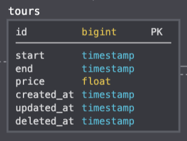

# UncleTech Laravel Assessment

Imagine that UncleTech was hired to create an online tour booking system. Your job is to develop an API in Laravel that can manage the tours of that company.

Below you will find the technical definitions of this API.

## Instructions

- Fork this repository
- Develop your API
- When you're done, make a Pull Request of your code here for us.
- If needed, send details by email to our HR.

### Database schema



### Resource Details

| Method|End-point | Description |
|-|-|-|
| GET  | /tours | Return all tours |
| GET  | /tours/{id} | Return specific tours data |
| POST  | /tours | Creates new tours |
| PUT  | /tours/{id} | Update or create specific tours data |
| DELETE  | /tours/{id} | Delete tours data |

#### Filtering

The return all GET request (/tours), should accept filtering options as follow:

|Filter|Operator|Route example|
|-|-|-|
|price|eq,lte,gte|`/tours?price[eq]=100`|
|start|eq,lte,gte|`/tours?start[eq]=2020-01-20T00:00:00`|
|end|eq,lte,gte|`/tours?end[eq]=2020-01-20T00:00:00`|

- lte = less than or equal to
- gte = greater than or equal to
- eq = equal

#### Pagination

The return all GET request (/tours), needs to accept pagination as follow:

```
/tours?limit=20&offset=20
```

### Comments

- Use laravel validation.
- Use soft delete trait.
- Use JSON format.
- Write  Unit tests for your API is a plus! 

Good luck!